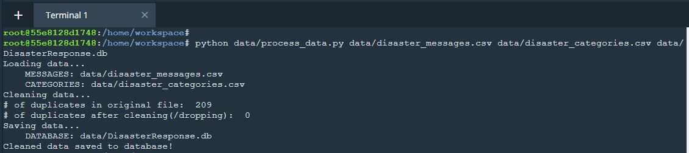
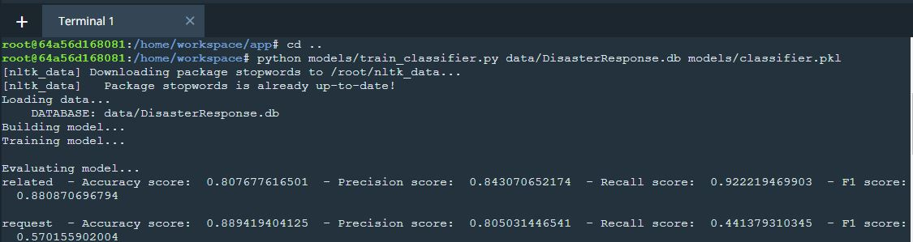
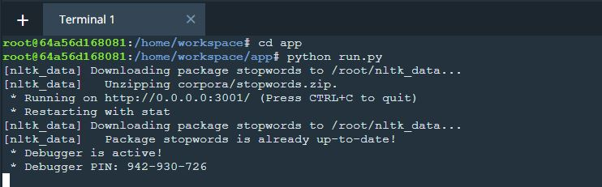
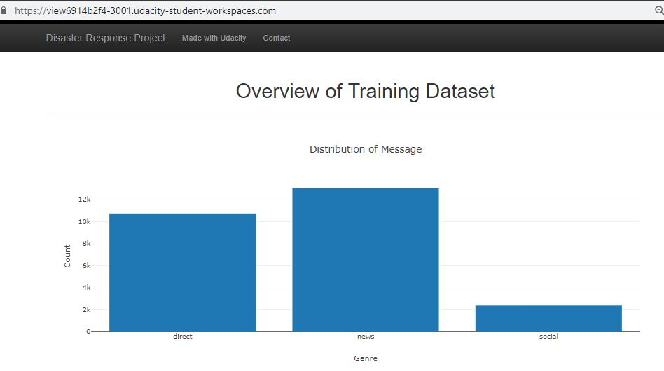
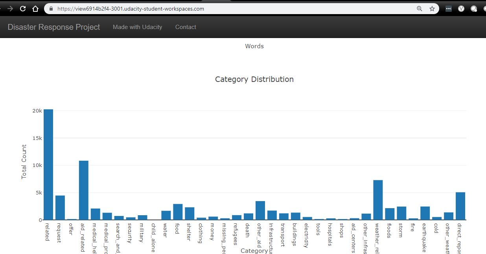
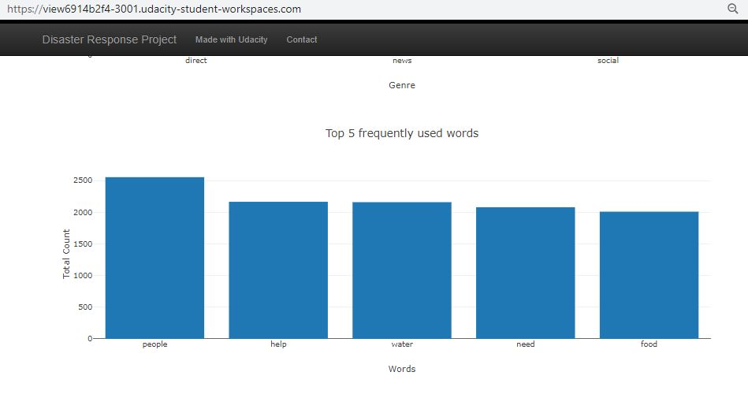
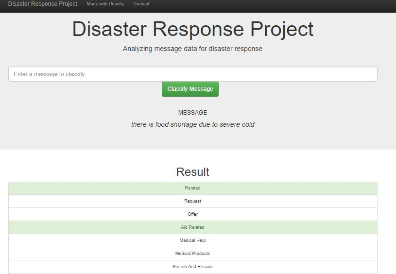

#  Disaster Response Pipeline
Udacity Data Scientist Nanodegree portfolio project to showcase ETL, ML and Webapp Dashboard development skills in Data Engineering module
## Table of Contents

- [Project Overview](#projectoverview)
- [Technical Overview](#technicaloverview)
- [Requirements](#requirements)
- [Running the application](#runapp)
  - [ETL Tasks](#etl)
  - [ML Tasks](#ml)
  - [Dashboard Web App](#webapp)
- [Conclusion](#conclusion)

***

## 1. Project Overview

In this project, we apply data engineering skills to analyze dataset provided by Figure Eight and build a ML model classifying disaster messages based on predefined categories. End result of this project is a web application where a user can type in input message and our application using ML model in the background, classifies the message based on several categories and then highlights various categories that the input message belong to.

## 2. Technical overview:
We have been provided with skeleton application and csv files with dataset so our focus in this project is purely on Data Engineering tasks. Flask application is already made available for us and we just plug in visualisation and connection to our ML model in order to make prediction for the input message from web app.

On a high level, project build is split up into 3 components:
1) ETL pipeline

### 2.1. ETL Pipeline
File: data/process_data.py

Action: 
This pipeline performs entire data clean up activity on the input datasets
- Load Messages and Categories csv datasets 
- Merge two datasets
- Clean data
- Save data into a **SQLite database**

### 2.2. ML Pipeline

File: models/train_classifier.py
This pipeline performs training and testing of ML model and save the result to a pickle file

- Loads data from the **SQLite database** (from ETL pipeline)
- Splits the data into training and testing sets
- Builds an ML pipeline with tasks specific to this dataset (tfidf and multioutput classification)
- Performs GridSearchCV to identify model with best hyperparameters
- Evaluate model and generate performance metrics
- Exports final (fine tuned) model to a pickle file

### 2.3. Web App
File: app/run.py
A dashboard styled web application is developed to show high-level charts regarding the trends from data and also a dedicated user screen to type in messages and get classification of messages based on disaster category the message relate to. Web application is built and run using Flask framework.

## 3. Requirements

All of the requirements are captured in requirements.txt. 
Run: pip install -r requirements.txt

## 4. Running the application

As application is built as 3 modules, we will be running each of these modules separately in sequential fashion.

### 4.1. Run ETL tasks
To run ETL pipeline that cleans data and stores in database
        `python data/process_data.py data/disaster_messages.csv data/disaster_categories.csv data/DisasterResponse.db`

### 4.2. Run ML tasks
To run ML pipeline that trains classifier and saves
        `python models/train_classifier.py data/DisasterResponse.db models/classifier.pkl`

### 4.3. Run WebApp
Run the following command in the app's directory to run your web app.
    `python run.py`
To view WebApp, go to http://0.0.0.0:3001/    

**_Starting WebApp_**

**Screenshots from WebApp**

**_Training Dataset Overview_**

**_Category Distribution_**

**_Top 5 frequently used words_**

**_Message Classification_**

## 5. Conclusion

From above screenshots we can see that the data is highly skewed. Though the accuracy metric is high, we can see that recall value is poor. In order to make this model as a robust decision making system for disaster message classification, skewed  data need to be managed.

